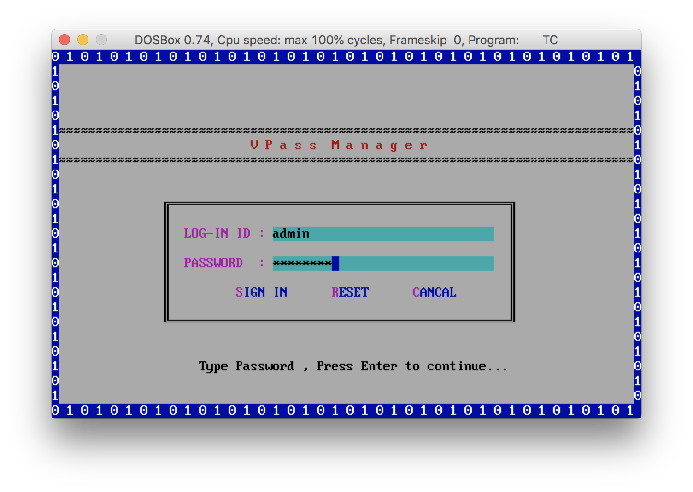
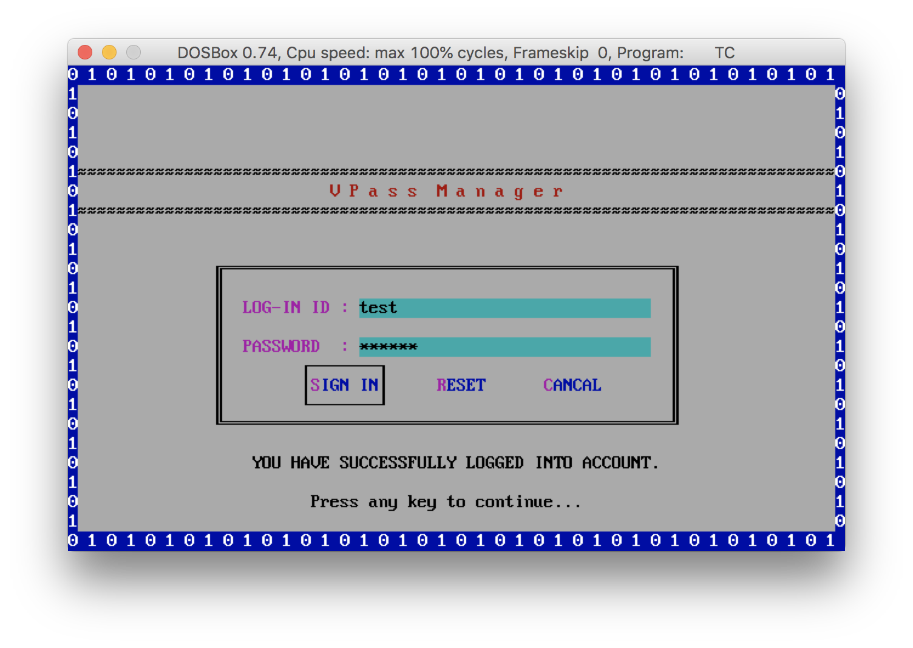

# :lock_with_ink_pen: V Pass Manager :closed_lock_with_key:

V Pass Manager manages passwords, bank account details, secure notes, etc. by securing it with encryption key. This project was made only for _learning purpose only_.

*This program is tested using Borland C++ Compiler.*

## File Structure
| File Name | Description |
| --- | --- |
| APP.CPP | main application |
| INCLUDE.CPP | includes declaration and definitions |
| ABTHELP.CPP | help menu functions |
| MENU.CPP | app menu functions |
| MENUHELP.CPP | app menu help functions |
| ENCRYPT.CPP | encryption utility functions |
| LICENSE.CPP | license file utility function |

## Screenshots
### Application
> Main Application Window

> About Us

> Exit Screen

### Authentication

If you're running program as is then below are the creds for auth:

Username : `admin`

Password : `password`

> Log-in Screen

> Log-in Successful

> Log-in Failed

> Log-out Screen

### Menus
> Add Data Menu

> Export Menu

> Settings Menu

For more menu screenshots, go [here](screenshots/menu/).

### Help Menu
> Help Delete Data Menu

> Help Export Data Menu

> Help Recovery Data Menu

For more help screenshots, go [here](screenshots/help/).

### License

#### When you decline to accept license aggrement, you'll get this :point_down: :joy: :stuck_out_tongue_winking_eye:

*This project is This project is licensed under the terms of the MIT license. under the terms of the MIT license.*
